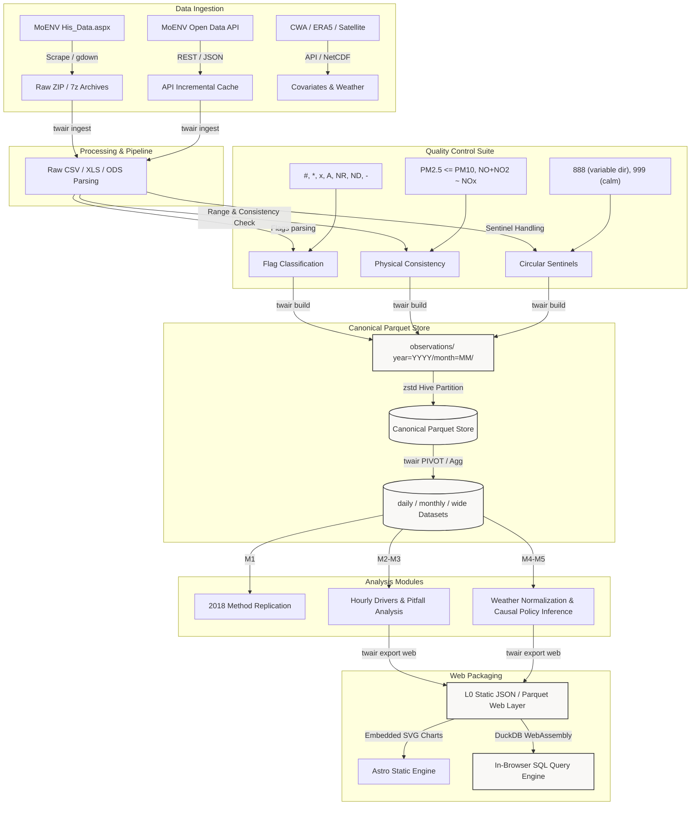

# air-quality｜Taiwan Air Quality Reanalysis

[](https://github.com/kuotunyu/air-quality/actions/workflows/ci.yml)

> Every hourly observation, at every station, from 1982 to the present:
> 341 million measurements, quality-flagged rather than quietly repaired,
> with an open pipeline and an interactive site on top.

### Taiwan's PM2.5 fell 60% between 2008 and 2025. About 43% of that was the weather, not emissions.

Measured by normalising out meteorological conditions — 61 stations, one set of rows, two lines.
Asked again by a completely different aggregation (the median of per-station slope ratios), the answer is 42.2%.
[See the chart →](https://kuotunyu.github.io/air-quality/#trend)

[繁體中文](README.md) ·
[Interactive site](https://kuotunyu.github.io/air-quality/) ·
Dataset — *not yet uploaded* ·
[Forecast demo](https://huggingface.co/spaces/steven0226/airlens-taiwan-forecast) ·
[Methodology](docs/methodology.md)

---

## What is this?

An open, quality-controlled reanalysis of **44 years** of Taiwanese air-quality
monitoring — 1982 to 2025, 341,442,552 hourly observations across 82 stations.
Three things come out of it:

1. **A dataset that did not previously exist.** Taiwan's ministry publishes the
   raw annual archives, but in four different container formats, two date
   orders, and with a quality-flag convention that changes from year to year.
   This project parses all of it into one canonical, per-row-provenanced store.
2. **A methodological comparison.** A 2018 undergraduate project analysed a
   subset of this data using monthly means ($N = 7{,}286$), OLS with stepwise
   elimination, and a mixed model with AR(1). Re-running that method beside a
   corrected one, on the same data, prices each choice.
3. **A site that lets you check the work**, including SQL over the whole record
   in your own browser.

### The governing principle

**Measure and publish data quality; never silently repair it.** Invalid
readings are flagged, not deleted. Out-of-range values keep their number so
they stay inspectable. Aggregates below a coverage threshold return **null**,
never a biased mean. Every gap on every chart is a real gap.

### On the 2018 project

It is the starting point, not the subject. This repository names no author or
supervisor, and reproduces none of its figures — only its *method choices*
(matters of methodological fact) and its *published numbers* (independently
verifiable). The original PDF is gitignored and is not redistributed.

Two of those choices turn out to matter a great deal:

1. **Using PM10 to predict PM2.5.** PM2.5 is physically a subset of PM10, so
   this is definitional overlap rather than an empirical finding. Measured
   cost: **32.1% of the leaking model's $R^2$** (0.524 → 0.772).
2. **Treating wind direction ($0^\circ$–$360^\circ$) as a linear variable.**
   $0^\circ$ and $359^\circ$ are adjacent but numerically $359$ apart. Under
   OLS, sin/cos encoding gives **2.55×** the $R^2$ of the raw bearing.

And two claimed defects were **overturned by the full data** and are documented
as such — see [PROGRESS.md](PROGRESS.md).

---

## System Architecture



---

## Four Main Deliverables

| | Description |
|---|---|
| 📦 **Open-Source Dataset** | 1982–Present hourly air quality observations + meteorology across Taiwan, packaged with original flags and hosted on HuggingFace. |
| 📊 **Reproducible Science** | Step-by-step replication of the 2018 method, followed by rigorous corrections and quantitative comparisons. |
| 🌐 **Interactive Dashboard** | Scroll-driven charts showing trends, individualized exposure reports, wind-vector fingerprinting, policy effects, and methodology comparisons. |
| 🔧 **Python Toolchain** | `twair` — An extensible, high-performance data pipeline with built-in QC, database management, and analysis. |

---

## Data Sources

All retrieved files originate from governmental open data portals under the *Government Data Open License, Version 1.0*.

| Source | Content | Spatial/Temporal | Span | Status |
|---|---|---|---|---|
| [Ministry of Environment (MoENV)](https://airtw.moenv.gov.tw/) | Historical Hourly Archives | All 82 monitoring stations | 1982–2025 | ✅ **all 44 years held**; every result here comes from this |
| [MoENV Open Data Platform](https://data.moenv.gov.tw/) | Station Meta & Live AQI API | GPS Coordinates & Daily Updates | Real-time | ✅ in use (station register, freshness check) |
| [Central Weather Administration (CWA)](https://opendata.cwa.gov.tw/) | Meteorological Stations | Barometric pressure, solar radiation, visibility | Historical | ⬜ **not yet acquired** |
| [Copernicus Climate Change Service](https://cds.climate.copernicus.eu/) | **ERA5 Boundary Layer Height (BLH)** | 10m wind, 2m temp, surface pressure | 1982–Present | ⬜ **not yet acquired** |
| [Google Earth Engine (S5P / MODIS)](https://earthengine.google.com/) | Sentinel-5P TROPOMI & MODIS | Columnar NO2, SO2, CO, and 1km AOD | 2018–Present | ⬜ **not yet acquired** (Phase 6) |

Every meteorological variable in use today is measured by the air-quality stations' own instruments — temperature, humidity, rainfall, wind speed and bearing. Nothing comes from CWA or from a reanalysis yet.

> **Boundary Layer Height (BLH)** is the single most critical variable the original method omitted — and it is missing from this project too. Pollutant concentrations are roughly inversely proportional to the mixing boundary layer volume, so without BLH any attempt to model meteorological impacts on PM2.5 carries omitted-variable bias. The size of the gap is measurable: M4's meteorological normalisation has a median holdout R² of **0.445**, meaning more than half of hourly variance is not explained by local weather as currently observed. Adding BLH is one of the most valuable things left to do, and it has not been done, so it is written here as such.

---

## Quick Start

### 1. Synchronize the Environment
This project uses the modern, high-speed Python package manager `uv`:
```bash
uv sync
```

### 2. Configure Environment Variables
```bash
cp .env.example .env
```

### 3. Check System Integrity
```bash
uv run twair doctor
```

### 4. Locate & Cache Live Links
```bash
uv run twair probe sources
```
The `probe sources` utility crawls the Ministry of Environment page to locate current Google Drive archive download identifiers, downloads a tiny test chunk, verifies checksums, and populates `conf/sources.yaml` and `docs/data-sources.md`. 
Since governmental server links change periodically, this crawl step ensures we do not rely on brittle hardcoded URLs.

---

## Project Status

Current developmental milestones are tracked in **[PROGRESS.md](PROGRESS.md)**.

| Phase | Content | Status |
|---|---|---|
| **Phase 0** | Skeletal Framework & Source Inventory | ✅ Complete |
| **Phase 1** | Data Retrieval, Core QC, and Canonical Parquet Store | ✅ Complete |
| **Phase 2** | Method Replication (M1) & Robust Pitfall Demonstration (M3) | ✅ Complete |
| **Phase 3** | Astro Interactive Dashboard & DuckDB-WASM Setup | ✅ Complete |
| **Phase 4** | Weather Normalization (M4) & Policy Causal Inference (M5) | ✅ Complete |
| **Phase 5** | Source direction via CBPF (M7) ✅ / Spatial autocorrelation (M6) ✅ | ✅ **Done** |
| **Phase 6** | Satellite AOD & Low-Cost Micro-sensor Network Fusion | ⬜ Likely skipped |
| **Phase 7** | Forecasting (M9) & HF Space Demo | ✅ **Complete — [Space is live](https://huggingface.co/spaces/steven0226/airlens-taiwan-forecast)** |
| **Phase 8** | Health burden (M10) ✅ / freshness check ✅ / full report ⬜ | 🔄 **In progress** |

Read the full blueprints in [PLAN.md](PLAN.md).

---

## Web Dashboard

To run the interactive web interface locally:
```bash
# Export analytics results from Parquet into static front-end assets
uv run twair export web                 

# Set up and preview the Astro server
cd web
npm install
npm run dev    # Dashboard launches on http://localhost:4321
```

### Dashboard Core Philosophy
1. **Charts are HTML native**: Charts are compiled into lightweight SVGs inside Astro frontmatter. The website loads immediately and is completely interactive even with JavaScript disabled in the browser.
2. **Null Values are Sacred**: Missing data points represent periods of station inactivity or insufficient data coverage. Instead of smoothly interpolating across gaps, charts render distinct breaks.
3. **No External Query Servers**: The M6 explorer runs **DuckDB-WASM** compiled to WebAssembly. When a user explores daily records, DuckDB fetches only the required bytes from remote Parquet partitions via *HTTP Range Requests*—bypassing the need for database API keys or external server upkeep.

---

## Licensing

- **Software Source Code**: [MIT License](LICENSE)
- **Data Derivatives**: [Creative Commons Attribution 4.0 International (CC BY 4.0)](LICENSE-DATA). Source attribution belongs to the Ministry of Environment (Taiwan) and the Central Weather Administration (CWA).

---

## Citation

A personal side project — no DOI, no formal citation format. Link to the repository
if you need to reference it, and credit the data to Taiwan's Ministry of Environment.
