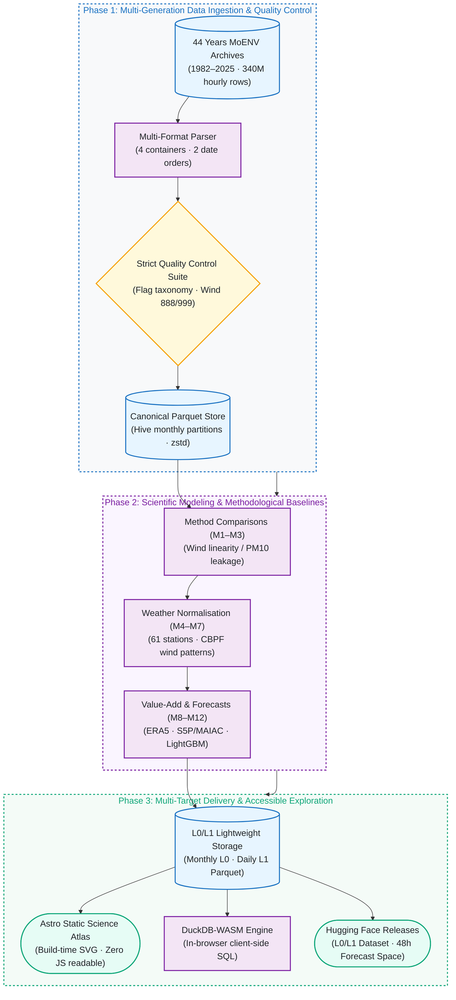
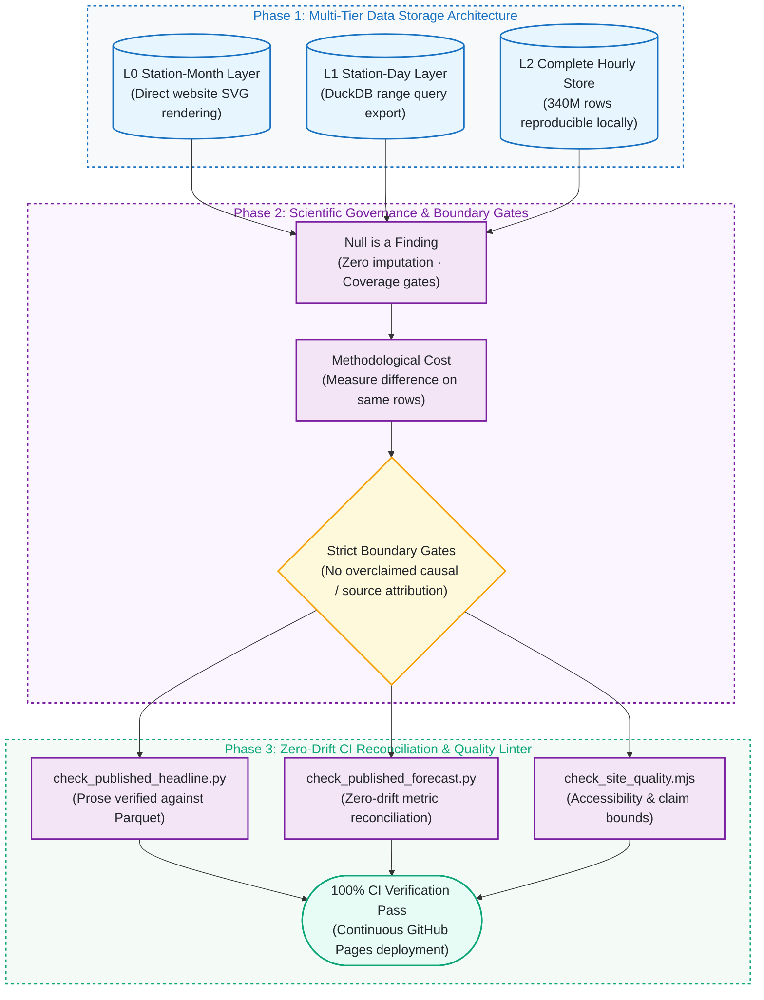

# air-quality｜Taiwan Air Quality Reanalysis

[](README.md)

[](https://github.com/kuotunyu/air-quality/actions/workflows/ci.yml)


[](LICENSE)

> Every hourly observation published in MoENV's 1982–2025 annual archives:
> 340 million measurements, quality-flagged rather than quietly repaired,
> with an open pipeline and an interactive site on top.

### Taiwan's PM2.5 fell 60% between 2008 and 2025; the meteorologically standardised decline is 43% smaller than the observed decline.

That 43% is a contrast between two estimated declines, not causal proof that weather produced 43% of the change; the remainder is not an emissions or policy estimate.
Measured by standardising meteorological conditions — 61 stations, one set of rows, two lines.
Asked again by a completely different aggregation (the median of per-station slope ratios), the answer is 42.2%.
The published M4 does not yet use ERA5 BLH, and long-range transport remains a limitation.

---

## System Architecture & Pipeline

### 1. 340M Observations Reanalysis & Scientific Modeling Pipeline



### 2. Data Governance & Zero-Drift CI Architecture



---

## Research Overview & Objectives

This study conducts an open, quality-controlled reanalysis of **44 years** (1982–2025) of Taiwanese air quality monitoring, consolidating **340,371,384 hourly observations** across 82 stations. The investigation centers on three scientific and engineering objectives:

1. **Multi-Era Historical Observation Standardization**: Ministry archives historically span four container formats, two date orderings, and evolving quality-flag taxonomies. This project resolves them into a unified, immutable canonical store with full row-level provenance.
2. **Empirical Benchmarking of Methodological Costs**: Common conventions—such as monthly aggregation, stepwise OLS, and predicting PM2.5 with PM10—are benchmarked against corrected alternatives on the **identical observation cohort**, quantifying the exact statistical penalty of each modeling choice.
3. **Client-Side Reproducible Analytical Platform**: Incorporates in-browser SQL execution via DuckDB-WASM, enabling direct client-side verification of all published metrics without external database dependencies.

### Governing Data Principles

**Measure and publish data quality; never silently repair it.** Invalid readings are flagged, not deleted. Out-of-range values keep their number so they stay inspectable. Aggregates below a coverage threshold return **null**, never a biased mean. Every gap on every chart reflects real missingness.

### The comparison is against a method, not against anyone

The flawed arm is not a description: it is an empirical model actually fitted here by `analysis/baseline.py`. Both arms run on the identical set of observations, ensuring every methodological cost is rigorously quantified:

1. **Using PM10 to predict PM2.5.** PM2.5 is physically a subset of PM10, so this is definitional overlap rather than an empirical finding. Measured cost: **32.1% of the leaking model's $R^2$** (0.524 → 0.772).
2. **Treating wind direction ($0^\circ$–$360^\circ$) as a linear variable.** $0^\circ$ and $359^\circ$ are physically adjacent but numerically $359$ apart. Under OLS, sin/cos encoding yields **2.55×** the $R^2$ of the raw bearing.

And two claimed defects were **overturned by the full data** and are documented as such — see [docs/working-rules.md](docs/working-rules.md).

---

## Core Deliverables

| Deliverable | Description |
|---|---|
| **Open-Source Dataset** | Public L0 station-month and L1 station-day aggregates for 1982–2025: the site's charts read L0 directly, L1 can be queried in the browser and exported as CSV from [chapter 9](https://kuotunyu.github.io/air-quality/explore/), and both layers are published as a [Dataset (L0/L1)](https://huggingface.co/datasets/steven0226/air-quality). The complete hourly L2 copy is not redistributed; the open pipeline and upstream archives rebuild it. |
| **Reproducible Science** | A deliberately flawed baseline, fitted here, then corrected choice by choice with every difference measured. |
| **Interactive Dashboard** | [Interactive evidence platform](https://kuotunyu.github.io/air-quality/) covering trends, station summaries, observed high-value wind-speed/direction patterns (not source identity, position, transport distance, or contribution), event-detection limits, forecasting, health assumptions, and method comparisons. |
| **Forecast Demo** | [Hugging Face Space](https://huggingface.co/spaces/steven0226/airlens-taiwan-forecast) — PM2.5 one to 48 hours ahead, against two baselines. |
| **Python Toolchain** | `twair` — An extensible, high-performance data pipeline with built-in QC, database management, and analysis. |

---

## Data Sources

MoENV and CWA data use Taiwan's *Government Data Open License, Version 1.0*.
Copernicus satellite inputs are governed separately by the
[Sentinel Data Legal Notice](https://sentinels.copernicus.eu/documents/247904/690755/Sentinel_Data_Legal_Notice).
See [docs/legal.md](docs/legal.md) for source-specific terms and redistribution boundaries.

| Source Authority & Product | Measured Content | Spatial & Temporal Span | Access Status |
|---|---|---|---|
| [Ministry of Environment (MoENV)](https://airtw.moenv.gov.tw/) | Historical Hourly Archives | All 82 monitoring stations | **all 44 years held**; every result here comes from this |
| [MoENV Open Data Platform](https://data.moenv.gov.tw/) | Station Meta & Live AQI API | GPS Coordinates & Daily Updates | **in use** (station register, freshness check) |
| [Central Weather Administration (CWA)](https://opendata.cwa.gov.tw/) | Meteorological Stations | Barometric pressure, solar radiation, visibility | **not yet acquired** |
| [Copernicus Climate Change Service](https://cds.climate.copernicus.eu/) | **ERA5 Boundary Layer Height (BLH)** | 10m wind, 2m temperature/dewpoint, surface pressure | 2024–2025 acquisition plus multi-year and held-out-station robustness complete; calibration not delivered |
| [Sentinel-5P TROPOMI](https://developers.google.com/earth-engine/datasets/catalog/COPERNICUS_S5P_OFFL_L3_NO2) | TROPOMI L3 via Google Earth Engine | Station-month tropospheric NO₂ and vertical SO₂ columns | 2024–2025 source acquisition, M8 association, and multi-year predictive robustness delivered; calibration/fusion not done |
| [MODIS MAIAC](https://developers.google.com/earth-engine/datasets/catalog/MODIS_061_MCD19A2_GRANULES) | MAIAC via Google Earth Engine | Aerosol optical depth | 2024–2025 source acquisition, M8 association, and multi-year predictive robustness delivered; AOD calibration/fusion not done |

<details>
<summary><b>Held-out predictive value of satellite and ERA5 features — per-fold counts and their limits</b> (click to expand)<br>
Both show incremental predictive information under held-out evaluation within 2025. Neither is
causal attribution, satellite PM2.5 calibration, a fusion field, or a replacement for M4.
Calibration and fusion remain deferred.</summary>

<br>

The 2025 M8 association and held-out predictive-value diagnostics delivered use
851 common complete station-months, 76 stations, and 12 months. Relative to a baseline containing
calendar seasonality and station geography, the combined all-satellite feature set improved both RMSE and R² in
3/4, 9/10, and 37/40 folds under held-quarter, held-station, and joint transfer, respectively.
Across the three designs, all satellite, AOD, NO₂, and SO₂ improved both metrics in 49/54,
44/54, 48/54, and 25/54 folds; SO₂ worsened both in 29/54. For the combined all-satellite feature set, the
overall median ΔRMSE was −0.588 µg/m³ and median ΔR² was +0.147. These 54 fold-evaluations
reuse the same 851 rows under three designs; they are not 54 independent years or stations, and
this is not future-year transfer. The evidence supports held-out predictive value within 2025 only,
not causality, calibration, fusion, or replacement of M4; calibration and fusion remain deferred.

The follow-up satellite multi-year robustness analysis used 76 common stations and
848 / 851 common complete station-months in 2024/2025; every baseline/candidate comparison
paired identical test rows. In all/AOD/NO₂/SO₂ order, within-year quarter replication improved
both RMSE and R² in 3/4, 4/4, 3/4, 3/4 folds in 2024 and 3/4, 3/4, 2/4, 1/4 in 2025;
the remaining folds worsened both metrics. The genuine future-year `2024_to_2025` test was
forward: improve / improve / improve / improve, with all-satellite at
−0.378 µg/m³ / +0.057 R². `2025_to_2024` is reverse-direction replication, not prediction of the past:
reverse: improve / improve / worsen / worsen, with all-satellite at −0.179 µg/m³ / +0.024 R².
When station and year were both held out, the forward direction improved in
10/10, 10/10, 9/10, 6/10 folds and the reverse in 10/10, 10/10, 9/10, 7/10.
This is predictive robustness only: not causal, calibration, fusion, satellite-estimated PM2.5,
and not a spatial-resolution claim or an M4 replacement.

ERA5 2025 source acquisition delivered 674,520 station-hour rows for 77 stations and
8,760 hours, with zero source nulls across all six variables. A separate value-add experiment
then compared temporal-only, station-weather, ERA5-weather, and combined information on the
same 632,760 complete station-hour rows from 74 stations and three forward local-time folds.
Combined versus station weather improved both RMSE and R² in 205 of 222 station-folds;
the median RMSE delta was −0.758 µg/m³ and the median R² delta was +0.249.

The follow-up robustness analysis used the same 74 stations and measured 636,244 paired rows in 2024 and 632,760 in 2025.
Combined versus station weather improved both metrics for 63/74, 66/74, and 70/74 stations in
same-station temporal, contemporaneous held-out-station spatial, and held-out-station-plus-year
transfer, respectively. Within-year replication improved 177/222 and 205/222 station-time-folds
in 2024 and 2025. ERA5 weather alone also improved both metrics for 59/74, 64/74, and 72/74
transfer stations, so the main increment is not merely the result of adding more features.

Sanchong, Tamsui, and Yangming had PM2.5 targets but no complete rows shared by all four
information sets in either year, so no value was filled and those stations were excluded.
Contemporaneous spatial transfer measures predictive generalisation, not future-year transfer.
These results are not causal attribution, calibration, or fusion. ERA5 has not been added to the published M4 model;
the released meteorological normalisation still uses station measurements.

</details>

<!--
For the measured state of the store and outputs, run `uv run twair status`.
The table below owns the public release boundary and next directions; durable
evidence and decisions live in the relevant public [technical docs](docs/).

| Phase | Current delivery | Disposition |
|---|---|---|
| **Phase 0** | Project skeleton, live airtw probe, real cross-generation samples, source documentation | Core complete; GEE satellite Stage A delivered; ERA5 2024–2025 acquisition and multi-year/held-out-station robustness delivered; CWA deferred |
| **Phase 1** | 1982–2025 canonical Parquet, QA/QC, coverage-aware aggregates | Complete; The L0/L1 Dataset is publicly available; the complete hourly L2 copy is not published |
| **Phase 2** | M1 replication, M2 hourly rebuild, M3 method comparisons, core report | Complete |
| **Phase 3** | Homepage, ten routed chapters, build-time SVG, DuckDB-WASM | Complete |
| **Phase 4** | M4 meteorological normalisation, M5 counterfactual + placebo detection limit | Bounded delivery; no policy-causal claim |
| **Phase 5** | M6 spatial structure, M7 CBPF observed high-value wind-speed/direction patterns (not source identity, position, transport distance, or contribution), and the spatial baseline and covariate-model readiness gates | The baseline `go` permitted bounded covariate-model design; the measured covariate-model gate is `stop`, so this fixed model branch closes; HYSPLIT, a 1 km field, and population-weighted exposure were not delivered; the full results and claim boundaries of both readiness gates are in [docs/methodology.md](docs/methodology.md) |
| **Phase 6** | Satellite, ERA5, and low-cost sensor value-adds | S5P and MAIAC source-acquisition Stage A delivered; the 2025 M8 association and held-out predictive-value diagnostics delivered; ERA5 2024–2025 robustness delivered; January 2025 micro-sensor observations, readiness, and grouped predictive benchmark delivered; January 2025 reference-station satellite-context predictive-value limit delivered; 2025 annual micro-sensor readiness audit delivered, and the Q4-supported cross-station agreement delivered — 5 of 29 folds scorable, the remaining 18 with an empty test set and 6 with an empty training set, all reported unscored rather than as zero; held-quarter and joint station-quarter are not estimable — while validated calibration and fusion remain deferred; not causal, not calibration, and not satellite-estimated PM2.5; the agreement audit's full result and claim boundary are in [docs/methodology.md](docs/methodology.md) |
| **Phase 7** | M9 four-horizon forecast, M12 SARIMA, public HF Space | Complete; DL/GNN stretch goals excluded |
| **Phase 8** | M10 health assumptions, CI, weekly freshness, full website narrative | Release closeout complete: normal engineering and the editorial UI implementation are integrated into `master` and deployed to GitHub Pages, and the L0/L1 HF Dataset is public. The external-reader trial remains deferred and non-blocking; PyPI is optional. |

Implemented engineering decisions live in
[docs/working-rules.md](docs/working-rules.md); current data and method evidence
live in [docs/data-sources.md](docs/data-sources.md) and
[docs/methodology.md](docs/methodology.md).
-->

---

## Quick Start

```bash
uv sync
```

```bash
cp .env.example .env
```

```bash
uv run twair doctor
```

```bash
uv run twair probe sources
```

When run from a source checkout, the repository root serves as the workspace.
If running from an installed wheel, configure `TWAIR_WORKSPACE_DIR` in your process
environment before launch; otherwise, the current working directory is used. The
relative `data/`, `.env`, `conf/`, reports, and probe outputs remain within this
external workspace. If `conf/*.yaml` files are absent, the application reads the
read-only defaults packaged in the wheel. Refresh and probe commands create
workspace overrides and never rewrite the installed package.

The `probe sources` utility parses the live airtw annual catalogue, resolves current Google Drive identifiers, downloads one real archive sample, and populates `conf/sources.yaml` and `docs/data-sources.md`. Credentialed value-add sources remain explicitly unprobed when no credential is configured. Since government links change periodically, the catalogue is rediscovered rather than treated as a permanent hardcoded URL list.

---

## Web Dashboard

To run the interactive web interface locally:
```bash
uv run twair export web                 # Export analytics results from Parquet into static front-end assets
cd web && npm install && npm run dev    # Dashboard launches on http://localhost:4321
```

Astro static site architecture: charts are compiled directly into vector SVGs during build time, providing full offline readability and zero JavaScript dependency.

Live release: **<https://kuotunyu.github.io/air-quality/>**

---

## Licensing

- **Software Source Code**: [MIT License](LICENSE)
- **Data Derivatives**: [Creative Commons Attribution 4.0 International (CC BY 4.0)](LICENSE-DATA). Source attribution belongs to the Ministry of Environment (Taiwan). County boundaries come from the National Land Surveying and Mapping Center under the Open Government Data License v1.0.

---

## Citation

A personal side project — no DOI, no formal citation format. Link to the repository
if you need to reference it, and credit the data to Taiwan's Ministry of Environment.
