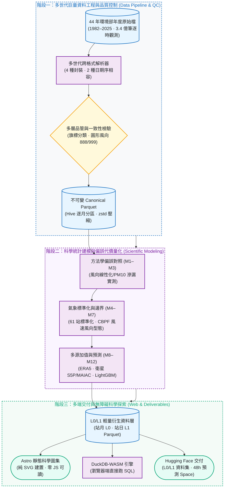
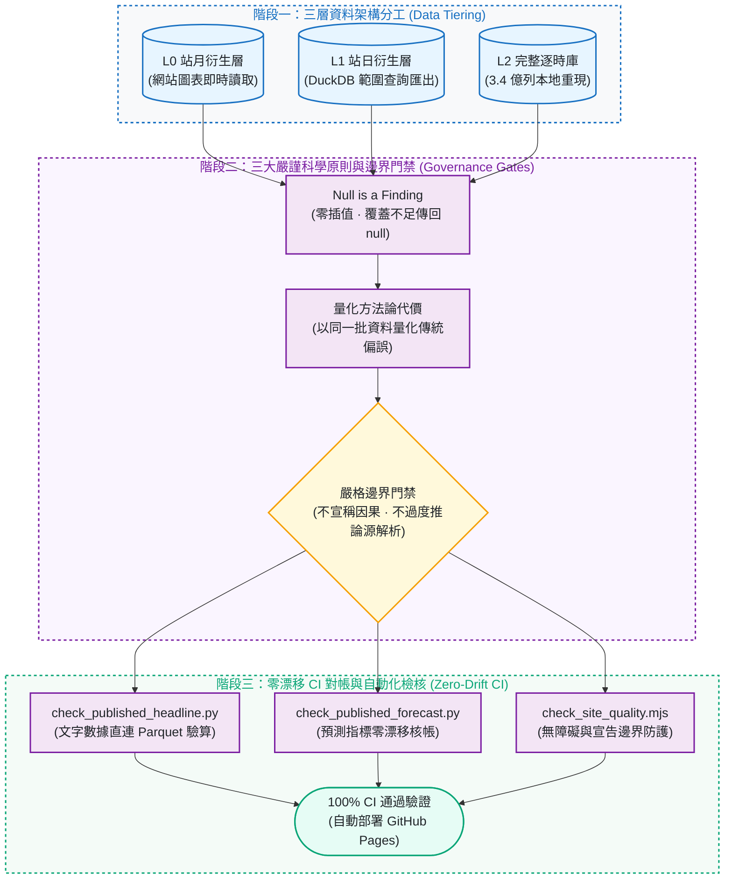

# air-quality｜台灣空氣品質再分析

[](README.en.md)

[](https://github.com/kuotunyu/air-quality/actions/workflows/ci.yml)


[](LICENSE)

> 1982–2025 年環境部年度檔裡的全台逐時原始觀測：
> 3.40 億筆資料，標記品質而不悄悄修補，
> 附上完整開源的管線與一個互動網站。

### 台灣的 PM2.5 在 2008–2025 年間下降了 60%；氣象標準化後的降幅比觀測值少 43%。

這個 43% 是兩條序列下降幅度的差額比例，不是「天氣造成 43%」的因果證明；剩餘也不是排放或政策貢獻估計。
這是把氣象條件標準化之後量出的對比——61 個測站、同一批資料、兩條線。
用另一種完全不同的聚合方式（逐站斜率比值的中位數）再問一次，答案是 42.2%。
已發布的 M4 尚未使用 ERA5 BLH，長程傳輸也仍是限制。

---

## 系統架構與資料管線

### 3.4 億筆觀測再分析與科學建模 Pipeline



### 資料治理架構與零漂移 CI 驗證防線



---

## 研究概述與核心目標

本研究為橫跨 **44 年**（1982–2025）之台灣空氣品質全量開放再分析工程，整合全台 82 個測站共 **340,371,384 筆逐時觀測資料**。核心工作聚焦三大面向：

1. **多世代異質歷史觀測標準化**：環境部歷年公開檔案橫跨四種封裝格式、兩種日期排序，品質旗標慣例隨年代更迭。本專案建構解析管線，重構成單一份標準化、具備逐列資料來源可追溯性的分析資料庫。
2. **經驗模型與方法學代價量化**：針對台灣空品研究常見之月平均壓縮、逐步篩選 OLS 及「以 PM10 預測 PM2.5」等經驗做法，在**同一組觀測資料**上平行配適對照模型，精確量測各建模選擇的統計偏誤與資訊洩漏代價。
3. **無依賴之客戶端數據複驗平台**：透過 DuckDB-WASM 於瀏覽器端原生執行 SQL 分析，研究圖表與統計指標均具備完全公開且可即時覆驗之計算路徑。

### 貫穿全案的資料治理原則

**測量並公布資料品質，絕不悄悄修補。** 無效值標記但不刪除；超出物理範圍的值保留原數字以供檢視；覆蓋率不足的聚合直接回傳 **null**，而不是一個有偏誤的平均。網站上每一條線的中斷都是真實資料缺失的如實反映。

### 對照組是方法，不是任何人

有缺陷的那一邊不是抽象描述，而是 `analysis/baseline.py` **實際配適出來的模型**——兩組模型在同一批觀測數據上執行，每個統計代價都是嚴謹量測得出：

1. **用 PM10 去預測 PM2.5**：PM2.5 在物理定義上即為 PM10 的子集，屬於定義重疊而非實證因果。實測代價：**含 PM10 的模型有 32.1% 的 R² 來自這個重疊**（0.524 → 0.772）。
2. **把風向（0–360°）當成線性連續變數**：0° 與 359° 在物理方位上相鄰，數值上卻相差 359。在 OLS 迴歸下，sin/cos 週期編碼的 R² 是原始方位角的 **2.55 倍**。

另外有**兩項原先列為缺陷、卻被全量資料否證**的說法，亦如實完整記錄——詳見 [docs/working-rules.md](docs/working-rules.md)。

---

## 核心產出

| 項目 | 內容說明 |
|---|---|
| **開源資料集** | 1982–2025 全測站的 L0 站月與 L1 站日衍生統計：L0 由網站圖表直接讀取，L1 可在[網站第九章](https://kuotunyu.github.io/air-quality/explore/)的瀏覽器內查詢並匯出 CSV，兩層已公開為 [資料集（L0／L1）](https://huggingface.co/datasets/steven0226/air-quality)。完整 L2 逐時複本不發布；任何人可用公開管線與上游資料重建 |
| **可重現研究** | 有缺陷的基準在這裡實際配適，逐項修正並量化差異 |
| **互動網站** | [線上探索平台](https://kuotunyu.github.io/air-quality/)涵蓋趨勢、個人化暴露報告、高值時段的風速／風向型態（不識別來源身分、位置、傳輸距離或貢獻）、事件偵測極限、方法學對照 |
| **預測 demo** | [Hugging Face Space](https://huggingface.co/spaces/steven0226/airlens-taiwan-forecast) — PM2.5 未來 1–48 小時，模型 vs 兩條基準線 |
| **Python 套件** | `twair` — 資料管線與分析工具 |

---

## 資料來源

環境部與中央氣象署資料依《政府資料開放授權條款第 1 版》使用；
Copernicus 衛星資料另依其 [Sentinel Data Legal Notice](https://sentinels.copernicus.eu/documents/247904/690755/Sentinel_Data_Legal_Notice)。
各來源的授權與再散布邊界見 [docs/legal.md](docs/legal.md)。

| 來源機構與資料集 | 觀測內容 | 涵蓋期間 | 取得狀態 |
|---|---|---|---|
| [環境部 空氣品質監測網](https://airtw.moenv.gov.tw/cht/Query/His_Data.aspx) | 全年逐時原始觀測 | 1982–2025 | **全部 44 年已取得**，本專案所有結果都出自這裡 |
| [環境部 環境資料開放平臺](https://data.moenv.gov.tw/) | 測站座標、即時 AQI | 即時 | **使用中**（測站登錄、資料新鮮度檢查） |
| [中央氣象署 開放資料平臺](https://opendata.cwa.gov.tw/) | 氣象站逐時觀測 | 近期 | **尚未取得** |
| [Copernicus ERA5](https://cds.climate.copernicus.eu/) | **邊界層高度**、10m 風、2m 溫度／露點、地面氣壓 | 1940– | 2024–2025 年來源取得與多年度／留出測站 robustness 已完成；校正尚未交付 |
| [Sentinel-5P TROPOMI](https://developers.google.com/earth-engine/datasets/catalog/COPERNICUS_S5P_OFFL_L3_NO2) | NO₂ 對流層柱濃度、SO₂ 垂直柱濃度 | 2018– | 2024–2025 站月來源、M8 關聯與 multi-year predictive robustness 已交付；校正／融合未做 |
| [MODIS MAIAC](https://developers.google.com/earth-engine/datasets/catalog/MODIS_061_MCD19A2_GRANULES) | 氣膠光學厚度 | 2000– | 2024–2025 站月來源、M8 關聯與 multi-year predictive robustness 已交付；AOD 校正／融合未做 |

### 衛星遙測與氣象再分析特徵之增量預測價值

> **方法學邊界宣告**：本階段評估僅量測機器學習模型於留出資料集（Held-out Sets）之**增量預測價值（Predictive Value）**，非因果歸因推論、非感測器空間融合（Sensor Fusion），亦非直接以衛星反演地表 PM2.5 濃度。

| 資訊來源 | 驗證樣本規模 | 跨站／跨期留出檢驗 (Held-out Evaluation) | 預測效益中位數 (Median Gain) | 邊界與限制 |
|---|---|---|---|---|
| **衛星遙測**<br/>(S5P NO₂/SO₂ + MAIAC AOD) | 851 筆共同完整站月<br/>(76 測站 · 12 個月份) | - 留出季度 (Held-quarter): **3／4** fold 同時改善<br/>- 留出測站 (Held-station): **9／10** fold 同時改善<br/>- 聯合轉移 (Joint transfer): **37／40** fold 同時改善<br/>(全特徵綜合改善率：**49／54** fold) | ΔRMSE: **−0.588 µg/m³**<br/>ΔR²: **+0.147** | 非因果推論、非衛星 PM2.5 校正；校正與融合仍延後 |
| **ERA5 再分析**<br/>(邊界層高度 BLH + 地表氣象) | 674,520 筆 station-hour<br/>(77 測站 · 6 變數皆為 0 null) | - 74 站共同樣本 (632,760 筆)：**205／222** station-fold 同時改善<br/>- 跨年同站 / 跨年留站：**63／74**、**70／74** 站同時改善 | ΔRMSE: **−0.758 µg/m³**<br/>ΔR²: **+0.249** | 尚未納入已發布 M4；正規化仍以站內觀測為準 |

<!--
2025 M8 關聯與 held-out predictive-value 診斷已交付。predictive-value 實驗使用
851 筆共同完整站月、76 站、12 個月份；all-satellite 相對只含月份週期與測站地理的
baseline，在 held-quarter、held-station、joint transfer 分別有 3／4、9／10、37／40 個
fold 同時改善 RMSE 與 R²。三種設計合併後，all-satellite、AOD、NO₂、SO₂ 分別有
49／54、44／54、48／54、25／54 個 fold 同時改善；SO₂ 另有 29／54 個 fold 變差。
all-satellite 的整體 median ΔRMSE 為 −0.588 µg/m³、median ΔR² 為 +0.147。
這 54 個 fold-evaluations 是同一批 851 筆資料在三種設計下的重複評估，不是 54 個獨立年份或測站，
也不是未來年度 transfer。結果只支持 2025 年內的 held-out predictive value；不是因果、校正、
融合或 M4 replacement，校正與融合仍延後。

後續 satellite multi-year robustness 使用 76 個共同測站，2024／2025 分別量得
848 / 851 common complete station-months，所有 baseline／candidate 比較都配對同一批 test rows。
按 all/AOD/NO₂/SO₂ 順序，同年度 quarter replication 在 2024 同時改善 RMSE 與 R² 的 fold 數為
3/4, 4/4, 3/4, 3/4，2025 為 3/4, 3/4, 2/4, 1/4；其餘 fold 對兩項指標同時變差。
真正的 future-year `2024_to_2025` 對四組特徵是
forward: improve / improve / improve / improve，all-satellite 的配對結果為
−0.378 µg/m³ / +0.057 R²。`2025_to_2024` 是反向複驗，不是預測過去；四組結果是
reverse: improve / improve / worsen / worsen，all-satellite 為 −0.179 µg/m³ / +0.024 R²。
再同時留出測站與年份時，`2024_to_2025` 的改善 fold 數為 10/10, 10/10, 9/10, 6/10，
`2025_to_2024` 為 10/10, 10/10, 9/10, 7/10。這是 predictive robustness only；
not causal, calibration, fusion, satellite-estimated PM2.5，且 not a spatial-resolution claim or an M4 replacement。

ERA5 2025 來源取得已交付：77 站、8,760 小時、674,520 筆 station-hour，
六個來源變數皆為 0 個 null。獨立 value-add 實驗再以 74 站的 632,760 筆共同完整
station-hour、三個 forward local-time folds，比較 temporal-only、站內氣象、ERA5 氣象與 combined
四種資訊集。combined 相對站內氣象在 205／222 個 station-fold 同時改善 RMSE 與 R²；
median RMSE delta 為 −0.758 µg/m³，median R² delta 為 +0.249。

後續 robustness 以相同 74 站量得 2024 年 636,244 筆、2025 年 632,760 筆
paired rows。combined 相對站內氣象在跨年同站、2025 同年留站、跨年留站三種 transfer
設計中，分別有 63／74、66／74、70／74 個測站同時改善 RMSE 與 R²；同年 replication
在 2024、2025 年則為 177／222、205／222 個 station-time-fold。ERA5-only 相對站內氣象
也分別改善 59／74、64／74、72／74 個 transfer 測站，顯示主要增量不是單純來自 feature 變多。

三重、淡水、陽明有 PM2.5 target，但兩年都沒有四組資訊集可共同使用的完整 rows，
因此沒有被塞值或強行納入。spatial transfer 使用同年度資料，只量測留出測站的
predictive generalisation；整組結果不是因果歸因、校正或融合。ERA5 尚未納入已發布的 M4；
網站上的氣象正規化仍只使用站內觀測。

目前磁碟與產物的可量測狀態，請先執行 `uv run twair status`。公開 release boundary
與後續方向見下表；可重用的實測證據與穩定決策見相關的 [docs/](docs/) 技術文件。

| 階段 | 目前交付 | 交付判定 |
|---|---|---|
| Phase 0 | 專案骨架、airtw live probe、真實跨世代樣本與資料源文件 | 核心完成；GEE 衛星 Stage A 已交付；ERA5 2024–2025 來源取得與多年度／留出測站 robustness 已交付；CWA 延後 |
| Phase 1 | 1982–2025 Canonical Parquet、QA/QC、coverage-aware aggregates | 完成；L0／L1 Dataset 已公開上架；完整 L2 逐時複本不發布 |
| Phase 2 | M1 基準、M2 逐時重做、M3 方法學對照與核心報告 | 完成 |
| Phase 3 | 首頁、10 個主題 route、build-time SVG、DuckDB-WASM | 完成 |
| Phase 4 | M4 氣象正規化、M5 counterfactual + placebo 偵測極限 | 有界完成，不宣稱政策因果 |
| Phase 5 | M6 空間結構、M7 CBPF 高值時段的風速／風向型態（不識別來源身分、位置、傳輸距離或貢獻）、spatial baseline 與 covariate-model readiness gates | baseline gate 的 `go` 允許了有界的 covariate-model design；實測 covariate-model gate 為 `stop`，所以這個固定模型分支關閉；HYSPLIT／1 km 場／人口加權暴露未交付；兩個 readiness gate 的完整結果與 claim boundary 見 [docs/methodology.md](docs/methodology.md) |
| Phase 6 | 衛星、ERA5 與微型感測器加值 | S5P 與 MAIAC 來源取得 Stage A 已交付；2025 M8 關聯與 held-out predictive-value 診斷已交付；ERA5 2024–2025 robustness 已交付；微型感測器 2025-01 觀測、readiness 與 grouped predictive benchmark 已交付，一月 reference-station satellite-context predictive-value limit 已交付，微型感測器 2025 全年 readiness audit 已交付，Q4-supported cross-station agreement 亦已交付（29 個 fold 中只有 5 個可評分，其餘 18 個測試集為空、6 個訓練集為空，均標為 unscored 而非以零計；held-quarter 與 joint station-quarter 不可估計）；validated calibration 與融合仍延後；不是因果、不是校正，也不是衛星推估 PM2.5；agreement audit 的完整結果與 claim boundary 見 [docs/methodology.md](docs/methodology.md) |
| Phase 7 | M9 四期距 forecast、M12 SARIMA、公開 HF Space | 完成；DL／GNN stretch goals 不納入 |
| Phase 8 | M10 健康假設、CI、weekly freshness、完整網站敘事 | 發布收尾完成：正常工程與編輯式科學圖集 UI 已整合至 `master`、部署於 GitHub Pages，L0／L1 HF Dataset 亦已公開。非本科讀者試讀延後且不阻擋發布；PyPI 選配。 |

磁碟上的實際狀態用 `uv run twair status` 看——這份表寫的是 release 邊界；
那個指令量的是本機事實。已實作的工程取捨見
[docs/working-rules.md](docs/working-rules.md)，資料與方法的現行證據分別見
[docs/data-sources.md](docs/data-sources.md) 與 [docs/methodology.md](docs/methodology.md)。
-->

---

## 本地運行指南

### Python 資料分析管線 (CLI)

```bash
uv sync                     # 安裝 Python 依賴與環境
cp .env.example .env        # 建立環境設定
uv run twair doctor         # 驗證系統環境與依賴相容性
uv run twair probe sources  # 解析年度目錄並取得即時資料樣本
```

從 source checkout 執行時，repository root 即為工作目錄。若從安裝好的 wheel 執行，可在啟動前設定 `TWAIR_WORKSPACE_DIR` 環境變數。`probe sources` 指令會自動解析環境部最新開放檔案目錄結構並驗證連線，確保取得之資料與配置具備完全再現性。

### 前端視覺化網站 (Web Dashboard)

```bash
uv run twair export web                 # 從 Parquet 匯出前端分析資料層
cd web && npm install && npm run dev    # 本地啟動：http://localhost:4321
```

Astro 靜態架構，所有圖表於建置期直接編譯為原生向量 SVG，支援深淺色主題切換，無須依賴額外繪圖套件，且在禁用 JavaScript 環境下仍具備完整可讀性。

線上發布版本：**<https://kuotunyu.github.io/air-quality/>**

---

## 授權

- Code：[MIT](LICENSE)
- 資料集與分析產出：[CC BY 4.0](LICENSE-DATA)，原始資料出處為中華民國環境部
  （地圖的縣市界線來自內政部國土測繪中心，依政府資料開放授權條款第 1 版）
